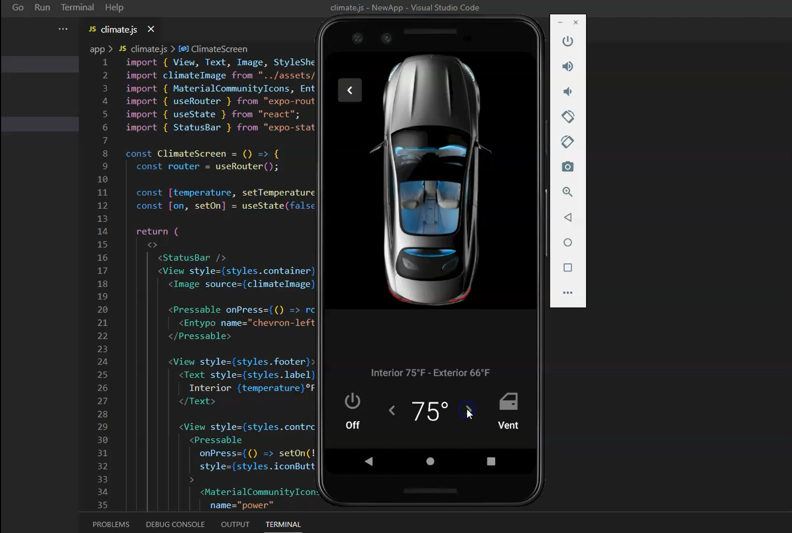
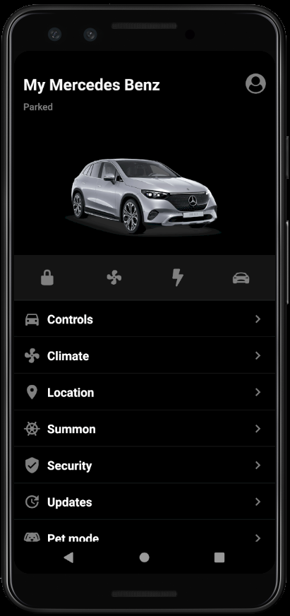
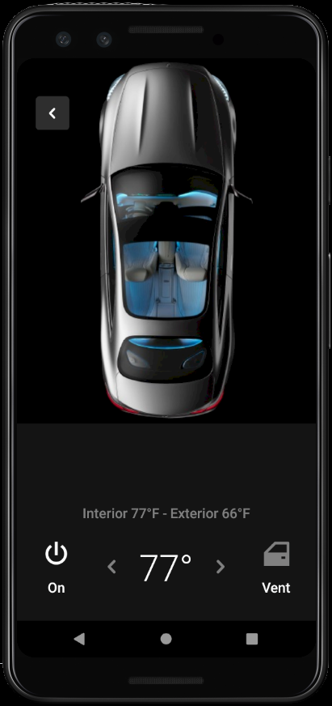

# Mercedes Benz EV Mobile App

This is a mobile app developed using Expo and React Native that allows Mercedes Benz electric vehicle (EV) owners to control and monitor their car's functions remotely.

## Features

- View vehicle information such as battery level, range, and charging status.
- Climate Control

## Demo Video

## Screenshots

